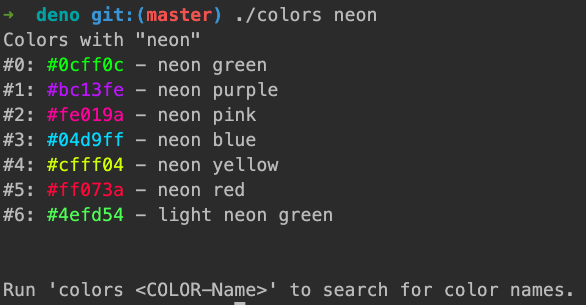

# Colors (Deno)



## Run 
```shell
./colors               # List all colors
./colors <COLOR-NAME>  # List all colors with name
```

## Dev
1. [Install deno](https://deno.land/manual@v1.11.5/getting_started/installation)
2. Reformat: `deno fmt`   
3. Run locally: `deno run --allow-net src/index.ts <COLOR-NAME>`
4. Compile: `deno compile --allow-net --output colors src/index.ts`
